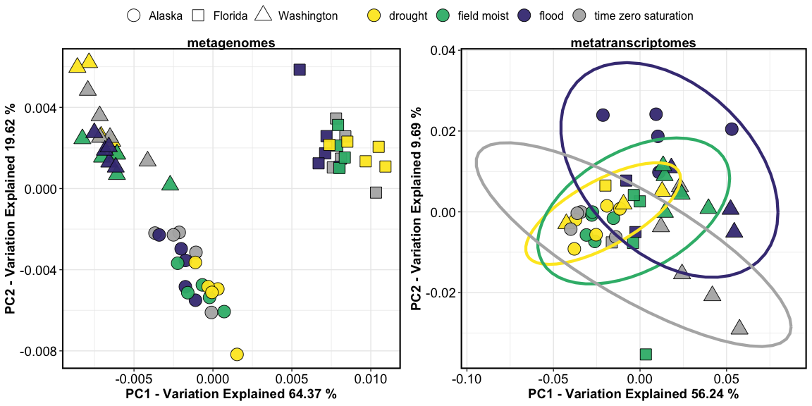

metag-metat
================

<!-- -->

-----

#### Session Info

date run: 2020-06-28

    ## R version 4.0.1 (2020-06-06)
    ## Platform: x86_64-apple-darwin17.0 (64-bit)
    ## Running under: macOS Mojave 10.14.6
    ## 
    ## Matrix products: default
    ## BLAS:   /Library/Frameworks/R.framework/Versions/4.0/Resources/lib/libRblas.dylib
    ## LAPACK: /Library/Frameworks/R.framework/Versions/4.0/Resources/lib/libRlapack.dylib
    ## 
    ## locale:
    ## [1] en_US.UTF-8/en_US.UTF-8/en_US.UTF-8/C/en_US.UTF-8/en_US.UTF-8
    ## 
    ## attached base packages:
    ##  [1] grid      parallel  stats4    stats     graphics  grDevices utils    
    ##  [8] datasets  methods   base     
    ## 
    ## other attached packages:
    ##  [1] viridis_0.5.1               viridisLite_0.3.0          
    ##  [3] forcats_0.5.0               stringr_1.4.0              
    ##  [5] purrr_0.3.4                 readr_1.3.1                
    ##  [7] tidyr_1.1.0                 tibble_3.0.1               
    ##  [9] tidyverse_1.3.0             pheatmap_1.0.12            
    ## [11] dplyr_1.0.0                 ggplot2_3.3.2              
    ## [13] preprocessCore_1.50.0       DESeq2_1.28.1              
    ## [15] SummarizedExperiment_1.18.1 DelayedArray_0.14.0        
    ## [17] matrixStats_0.56.0          Biobase_2.48.0             
    ## [19] GenomicRanges_1.40.0        GenomeInfoDb_1.24.2        
    ## [21] IRanges_2.22.2              S4Vectors_0.26.1           
    ## [23] BiocGenerics_0.34.0         reshape2_1.4.4             
    ## [25] ape_5.4                     vegan_2.5-6                
    ## [27] lattice_0.20-41             permute_0.9-5              
    ## [29] funrar_1.4.1               
    ## 
    ## loaded via a namespace (and not attached):
    ##  [1] colorspace_1.4-1       ggsignif_0.6.0         ellipsis_0.3.1        
    ##  [4] rio_0.5.16             XVector_0.28.0         fs_1.4.1              
    ##  [7] rstudioapi_0.11        farver_2.0.3           ggpubr_0.4.0          
    ## [10] bit64_0.9-7            AnnotationDbi_1.50.0   fansi_0.4.1           
    ## [13] lubridate_1.7.9        xml2_1.3.2             splines_4.0.1         
    ## [16] geneplotter_1.66.0     knitr_1.28             jsonlite_1.6.1        
    ## [19] broom_0.5.6            annotate_1.66.0        cluster_2.1.0         
    ## [22] dbplyr_1.4.4           compiler_4.0.1         httr_1.4.1            
    ## [25] backports_1.1.8        assertthat_0.2.1       Matrix_1.2-18         
    ## [28] cli_2.0.2              htmltools_0.5.0        tools_4.0.1           
    ## [31] gtable_0.3.0           glue_1.4.1             GenomeInfoDbData_1.2.3
    ## [34] Rcpp_1.0.4.6           carData_3.0-4          cellranger_1.1.0      
    ## [37] vctrs_0.3.1            nlme_3.1-148           xfun_0.15             
    ## [40] openxlsx_4.1.5         rvest_0.3.5            lifecycle_0.2.0       
    ## [43] rstatix_0.6.0          XML_3.99-0.3           zlibbioc_1.34.0       
    ## [46] MASS_7.3-51.6          scales_1.1.1           hms_0.5.3             
    ## [49] RColorBrewer_1.1-2     yaml_2.2.1             curl_4.3              
    ## [52] memoise_1.1.0          gridExtra_2.3          stringi_1.4.6         
    ## [55] RSQLite_2.2.0          genefilter_1.70.0      zip_2.0.4             
    ## [58] BiocParallel_1.22.0    rlang_0.4.6            pkgconfig_2.0.3       
    ## [61] bitops_1.0-6           evaluate_0.14          labeling_0.3          
    ## [64] cowplot_1.0.0          bit_1.1-15.2           tidyselect_1.1.0      
    ## [67] plyr_1.8.6             magrittr_1.5           R6_2.4.1              
    ## [70] generics_0.0.2         DBI_1.1.0              pillar_1.4.4          
    ## [73] haven_2.3.1            foreign_0.8-80         withr_2.2.0           
    ## [76] mgcv_1.8-31            abind_1.4-5            survival_3.2-3        
    ## [79] RCurl_1.98-1.2         modelr_0.1.8           crayon_1.3.4          
    ## [82] car_3.0-8              rmarkdown_2.3          locfit_1.5-9.4        
    ## [85] readxl_1.3.1           data.table_1.12.8      blob_1.2.1            
    ## [88] reprex_0.3.0           digest_0.6.25          xtable_1.8-4          
    ## [91] munsell_0.5.0
