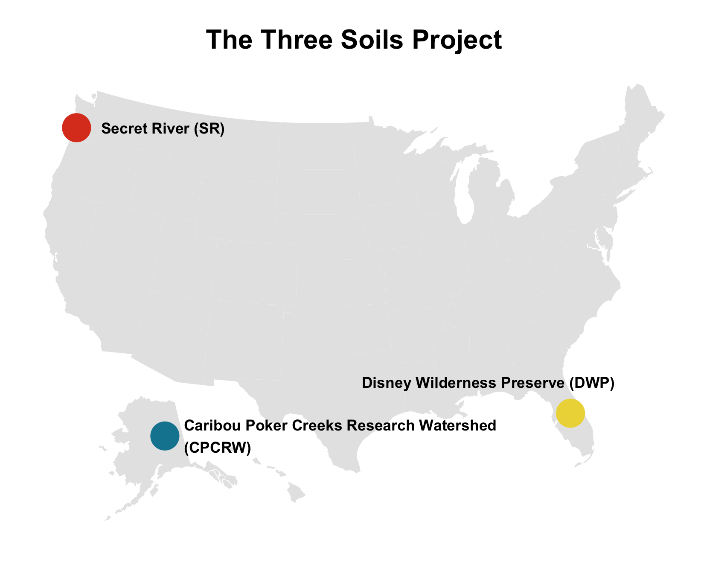
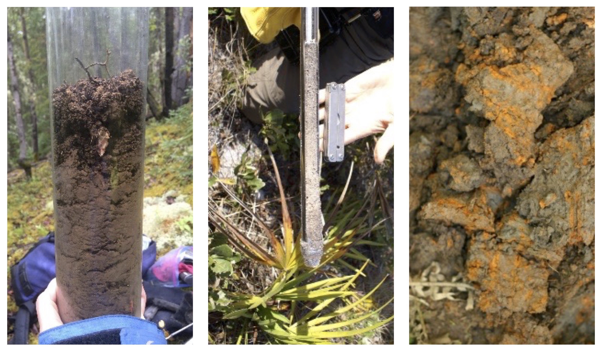

[](https://zenodo.org/badge/latestdoi/205486867)


# Soil texture and environmental conditions influence the biogeochemical responses of soils to drought and flooding 

Kaizad F. Patel et al. 2021

This repository contains data and processing/analysis scripts for the PNNL-TES 3Soils Project.  
DOI: 10.5281/zenodo.4792655


**Abstract**

Climate change is intensifying the global water cycle, with increased frequency of drought and flood. Water is an important driver of soil carbon dynamics, and it is crucial to understand how moisture disturbances will affect carbon availability and fluxes in soils. Here we investigate the role of water in substrate-microbe connectivity and soil carbon cycling under extreme moisture conditions. We collected soils from Alaska, Florida, and Washington USA, and incubated them under Drought and Flood conditions. Drought had a stronger effect on soil respiration, pore-water carbon, and microbial community composition than flooding. Soil response was not consistent across sites, and was influenced by site-level pedological and environmental factors. Soil texture and porosity can influence microbial access to substrates through the pore network, driving the chemical response. Further, the microbial communities are adapted to the historic stress conditions at their sites and therefore show site-specific responses to drought and flood.

---


<center></center>

<center></center>

---

## Directory Structure


```

home
|------ code/
|        |------ picarro/
|------ data/
|        |------ metagt_new/
|        |------ moisture/
|        |------ picarro/
|        |------ processed/
|------ fticr/
|------ markdown/
|------ outputs/
|
|------ map.png
|------ README.md
|------ tes_3soils_2019.rproj

```

Last updated: 2021-05-25
