3soils\_markdown
================
Kaizad Patel

-   [Soil characterization](#soil-characterization)
    -   [summary table](#summary-table)
    -   [pore distribution](#pore-distribution)
    -   [water retention curves](#water-retention-curves)
-   [WSOC tables](#wsoc-tables)
    -   [soils](#soils)
    -   [pores](#pores)
-   [FTICR domains](#fticr-domains)
-   [FTICR Pores – figures](#fticr-pores-figures)
    -   [native SOM](#native-som)
    -   [treatment effect – all peaks](#treatment-effect-all-peaks)
    -   [treatment effect – unique
        peaks](#treatment-effect-unique-peaks)
    -   [treatment effect – relative
        abundance](#treatment-effect-relative-abundance)
    -   [treatment effect – NOSC](#treatment-effect-nosc)
    -   [NOSC table](#nosc-table)
    -   [aromatic peaks](#aromatic-peaks)
    -   [shannon diversity index –](#shannon-diversity-index)
-   [FTICR Pores – tables](#fticr-pores-tables)
    -   [peaks](#peaks)
    -   [unique peaks](#unique-peaks)
    -   [relative abundance](#relative-abundance)
    -   [Shannon diversity](#shannon-diversity)
-   [FTICR Soil – figures](#fticr-soil-figures)
    -   [native SOM](#native-som-1)
    -   [treatment effect – all peaks](#treatment-effect-all-peaks-1)
    -   [treatment effect – unique
        peaks](#treatment-effect-unique-peaks-1)
    -   [treatment effect – relative
        abundance](#treatment-effect-relative-abundance-1)
    -   [NOSC](#nosc)
    -   [NOSC table](#nosc-table-1)
    -   [lost/gained NOSC](#lostgained-nosc)
    -   [aromatic peaks](#aromatic-peaks-1)
-   [FTICR Soil – tables](#fticr-soil-tables)
    -   [relative abundance](#relative-abundance-1)
    -   [peaks](#peaks-1)
    -   [unique peaks](#unique-peaks-1)
    -   [aromatic peaks](#aromatic-peaks-2)
    -   [Shannon diversity](#shannon-diversity-1)
-   [Respiration](#respiration)
    -   [figures](#figures)
    -   [flux summary table](#flux-summary-table)

``` r
knitr::opts_chunk$set(echo=FALSE,message=FALSE,warning=FALSE,
                      collapse = TRUE,
                      comment = "#>",
                      fig.path = "images/md/")
```

This is the RMarkdown file for the 3Soils experiment. Tables and figures
for molecular results. For formatted tables, see the Word document
titled `000-3soils_markdown_YYYYMMDD.docx`.

Run: 2021-04-16

# Soil characterization

## summary table

|    variable |         CPCRW |           DWP |             SR |
|------------:|--------------:|--------------:|---------------:|
|    TC\_perc | 1.43 ± 0.21 b |  0.98 ± 0.1 b | 10.32 ± 0.45 a |
|    TN\_perc | 0.07 ± 0.01 b |    0.04 ± 0 b |  0.59 ± 0.01 a |
|   TOC\_perc | 1.43 ± 0.19 b | 0.88 ± 0.11 b |  9.94 ± 0.47 a |
| WSOC\_mg\_g | 1.04 ± 0.28 a |    1 ± 0.16 a |  0.67 ± 0.04 a |
| Ca\_meq100g | 3.52 ± 0.41 b | 0.81 ± 0.11 c | 17.21 ± 0.75 a |
| Mg\_meq100g | 1.08 ± 0.09 b | 0.26 ± 0.03 b |  7.56 ± 0.46 a |
|          pH | 5.31 ± 0.17 b | 4.79 ± 0.11 c |  5.82 ± 0.05 a |
|   EC\_dS\_m |  3.4 ± 0.51 b |  3.6 ± 1.21 b |        8 ± 0 a |
|  Sand\_perc | 5.2 ± 0.58 ab |   9.4 ± 0.4 a |   3.8 ± 1.83 b |
|  Silt\_perc |  7.2 ± 1.59 a |    4 ± 1.14 a |   8.2 ± 1.39 a |
|  Clay\_perc |  3.2 ± 0.37 b | 7.2 ± 1.74 ab |     8 ± 1.22 a |

------------------------------------------------------------------------

## pore distribution

<!-- -->

------------------------------------------------------------------------

## water retention curves

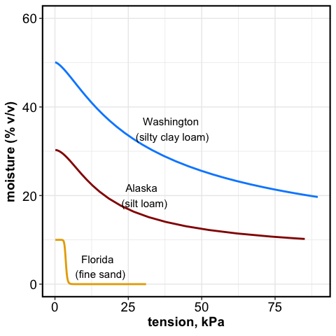<!-- -->

------------------------------------------------------------------------

# WSOC tables

## soils

mg/g soil

|   Treatment |       CPCRW |         DWP |          SR |
|------------:|------------:|------------:|------------:|
|     Drought |  0.85 ± 0.2 | 0.72 ± 0.37 |  0.6 ± 0.04 |
| Field Moist | 0.69 ± 0.07 | 0.35 ± 0.05 | 0.61 ± 0.05 |
|   Saturated | 0.59 ± 0.05 | 0.39 ± 0.06 | 0.55 ± 0.06 |
|   Time Zero |  0.78 ± 0.1 | 0.51 ± 0.08 | 0.43 ± 0.04 |

## pores

mg/L

|   Treatment |     1.5 kPa CPCRW |   1.5 kPa DWP |      1.5 kPa SR |      50 kPa CPCRW |    50 kPa DWP |       50 kPa SR |
|------------:|------------------:|--------------:|----------------:|------------------:|--------------:|----------------:|
|     Drought | 111.82 ± 41.45 \* |    69.02 ± 13 |     13.9 ± 2.43 | 186.86 ± 62.65 \* | 69.97 ± 13.39 |     19.3 ± 8.32 |
| Field Moist |      21.22 ± 3.73 | 46.33 ± 11.94 | 18.68 ± 2.36 \* |     41.17 ± 12.67 | 52.43 ± 14.74 |    19.82 ± 2.93 |
|   Saturated |     52.82 ± 13.98 |  42.08 ± 7.34 | 23.16 ± 3.29 \* |      63.4 ± 20.84 |  82.7 ± 16.52 | 24.07 ± 2.43 \* |
|   Time Zero |       26.3 ± 2.78 | 76.68 ± 21.76 |     6.03 ± 0.57 |      29.14 ± 4.41 | 92.33 ± 22.22 |     7.28 ± 0.34 |

figure 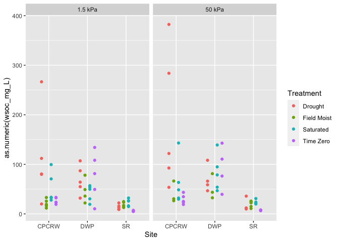<!-- -->

------------------------------------------------------------------------

# FTICR domains

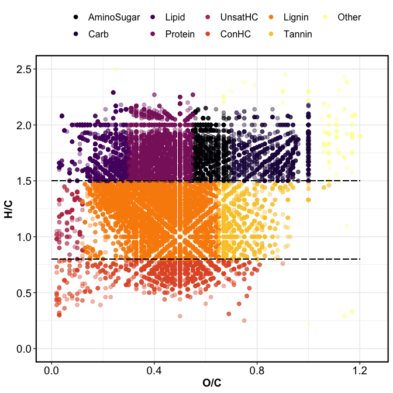<!-- -->

domains with NOSC

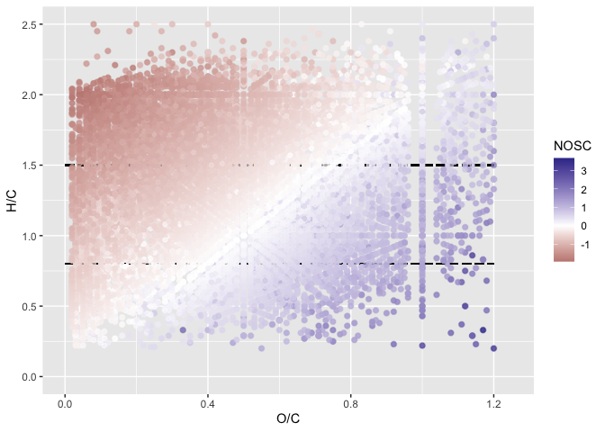<!-- -->

# FTICR Pores – figures

## native SOM

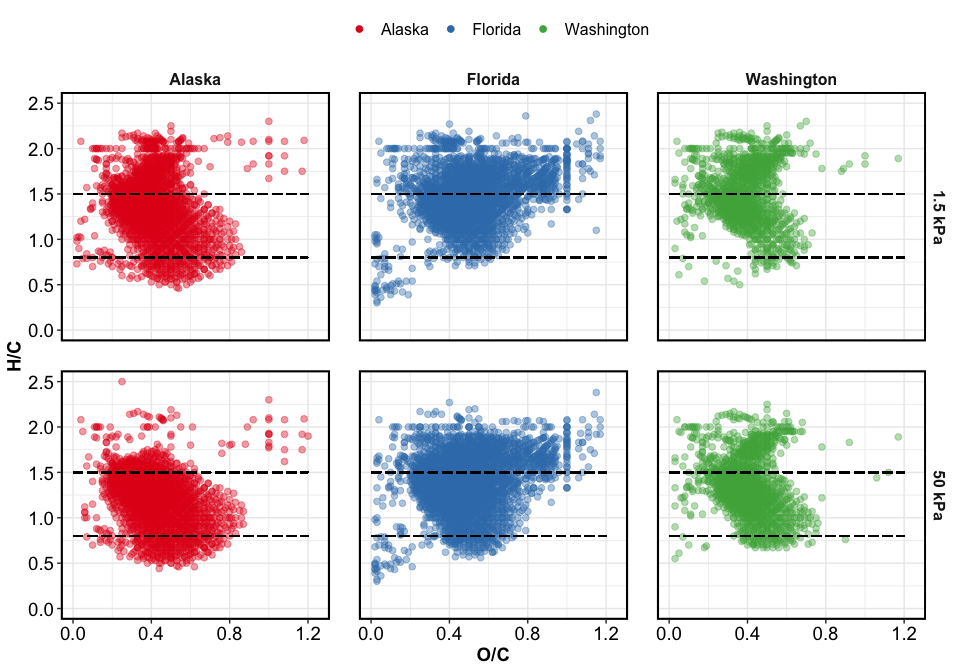<!-- -->

## treatment effect – all peaks

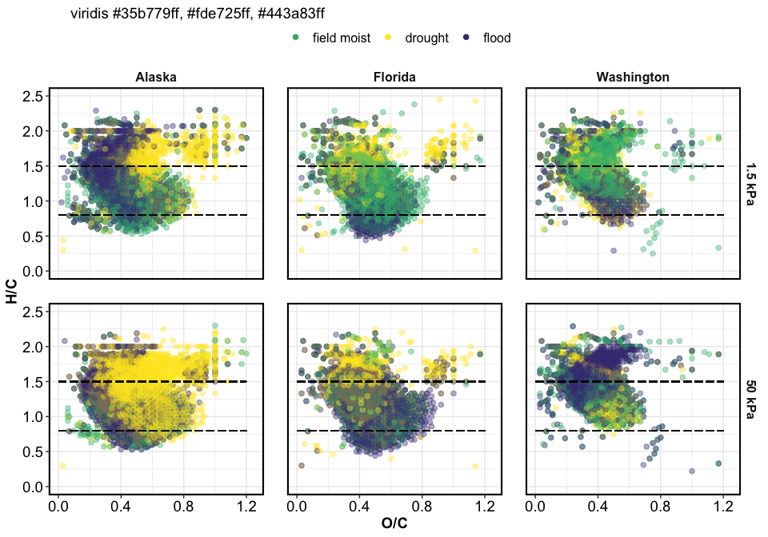<!-- -->

## treatment effect – unique peaks

unique in each treatment compared to all, including TZsaturation these
are peaks that were uniquely **added** during a given treatment

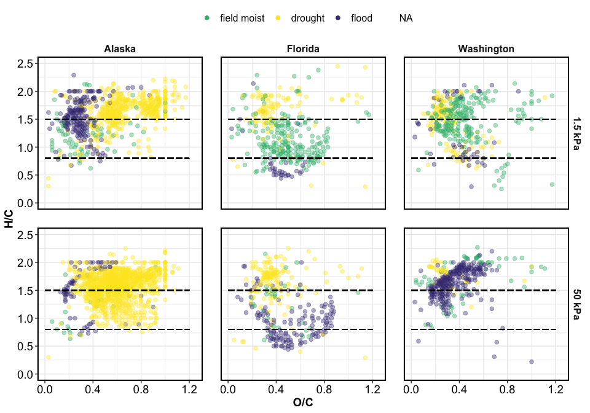<!-- -->

peaks lost and gained

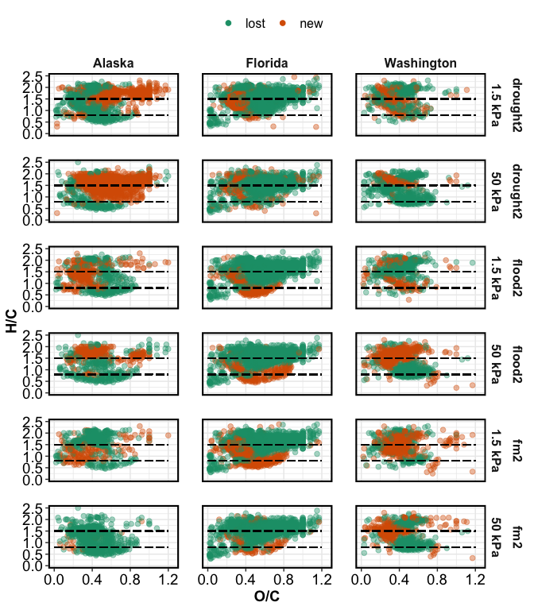<!-- -->

## treatment effect – relative abundance

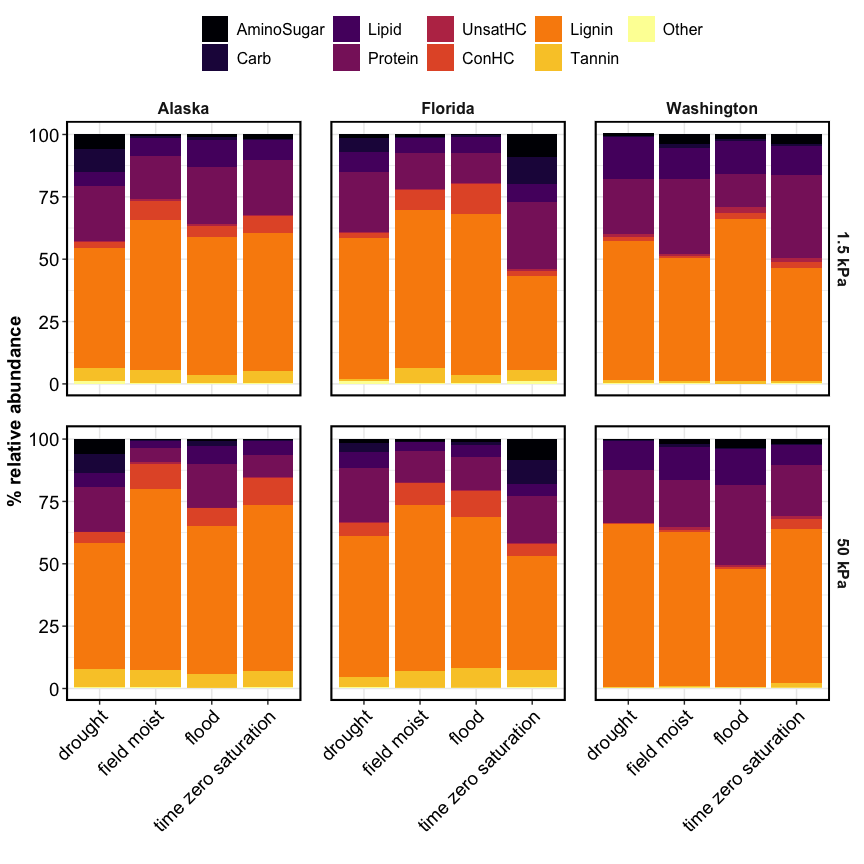<!-- -->

## treatment effect – NOSC

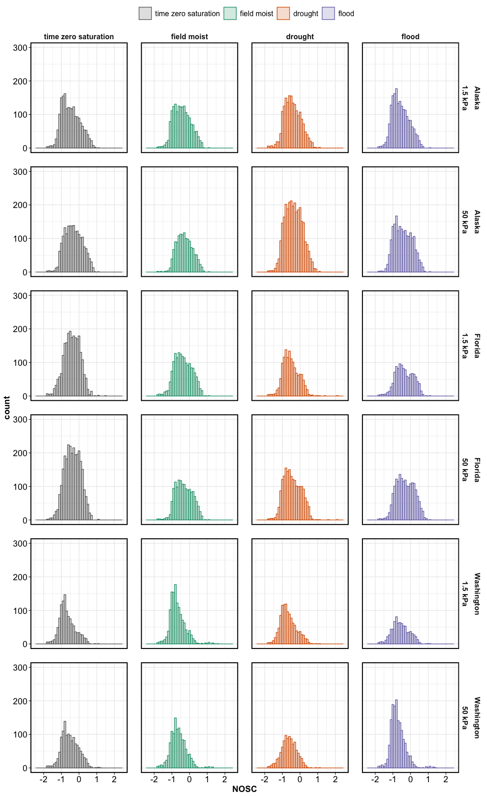<!-- -->

## NOSC table

| tension |       site | drought | field moist |   flood | time zero saturation |
|--------:|-----------:|--------:|------------:|--------:|---------------------:|
| 1.5 kPa |     Alaska | -0.4615 |     -0.4545 | -0.6207 |              -0.5217 |
| 1.5 kPa |    Florida | -0.5714 |     -0.4000 | -0.4000 |              -0.4000 |
| 1.5 kPa | Washington | -0.7333 |     -0.7586 | -0.6000 |              -0.7500 |
|  50 kPa |     Alaska | -0.3750 |     -0.3077 | -0.4615 |              -0.3333 |
|  50 kPa |    Florida | -0.4828 |     -0.3478 | -0.3333 |              -0.3636 |
|  50 kPa | Washington | -0.6250 |     -0.6667 | -0.7826 |              -0.5578 |

## aromatic peaks

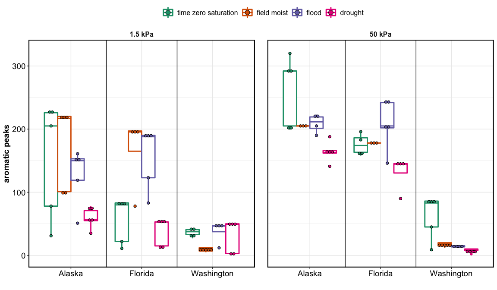<!-- -->

aromatic peaks – Van Krevelen

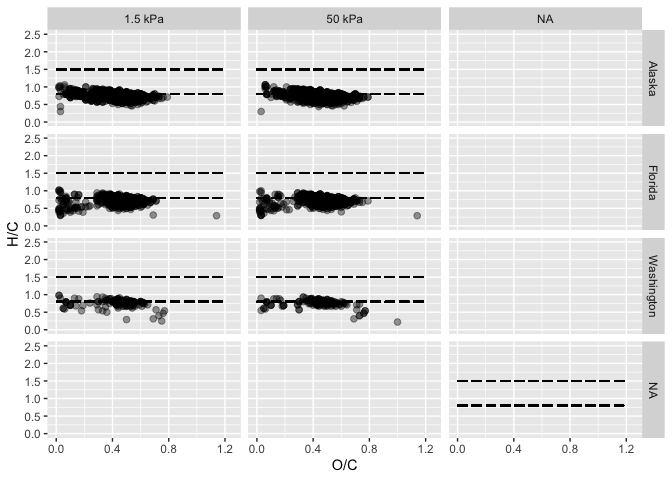<!-- -->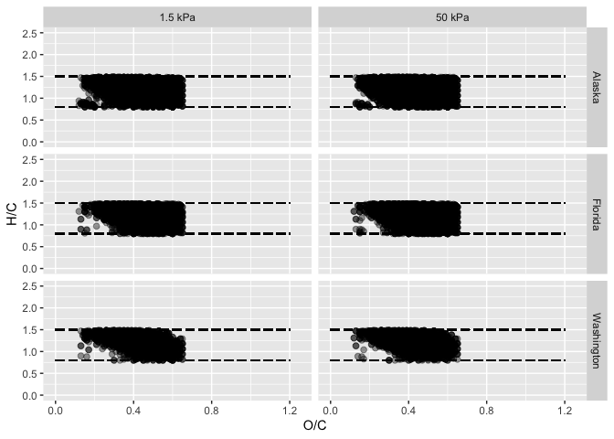<!-- -->

## shannon diversity index –

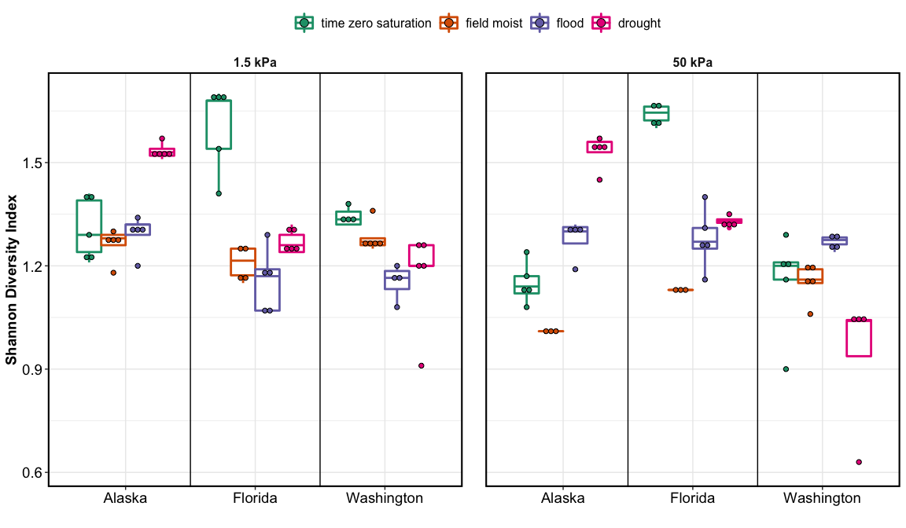<!-- -->

# FTICR Pores – tables

## peaks

    #> [1] "50 kPa"

|       site |      Class | drought | field moist | flood | time zero saturation |
|-----------:|-----------:|--------:|------------:|------:|---------------------:|
|     Alaska | AminoSugar |     201 |           5 |    17 |                   10 |
|     Alaska |       Carb |     255 |           7 |    51 |                   15 |
|     Alaska |      Lipid |     148 |          38 |   152 |                  120 |
|     Alaska |    Protein |     511 |          79 |   352 |                  180 |
|     Alaska |    UnsatHC |       2 |           8 |     1 |                    9 |
|     Alaska |      ConHC |     138 |         136 |   150 |                  247 |
|     Alaska |     Lignin |    1391 |        1001 |  1168 |                 1230 |
|     Alaska |     Tannin |     229 |          93 |   118 |                  120 |
|     Alaska |      Other |      11 |           8 |     1 |                   10 |
|     Alaska |      total |    2886 |        1375 |  2010 |                 1941 |
|    Florida | AminoSugar |      34 |          18 |    23 |                  254 |
|    Florida |       Carb |      68 |           2 |    24 |                  273 |
|    Florida |      Lipid |     132 |          54 |   103 |                  146 |
|    Florida |    Protein |     416 |         188 |   250 |                  535 |
|    Florida |    UnsatHC |       4 |           3 |     8 |                   15 |
|    Florida |      ConHC |     105 |         132 |   194 |                  144 |
|    Florida |     Lignin |    1062 |         996 |  1072 |                 1243 |
|    Florida |     Tannin |      78 |         105 |   150 |                  187 |
|    Florida |      Other |      10 |           1 |     2 |                   20 |
|    Florida |      total |    1909 |        1499 |  1826 |                 2817 |
| Washington | AminoSugar |       6 |          26 |    57 |                   34 |
| Washington |       Carb |       5 |          18 |    11 |                    2 |
| Washington |      Lipid |     133 |         176 |   228 |                  108 |
| Washington |    Protein |     245 |         250 |   490 |                  283 |
| Washington |    UnsatHC |       3 |          15 |    15 |                   16 |
| Washington |      ConHC |       3 |          13 |    15 |                   61 |
| Washington |     Lignin |     593 |         741 |   738 |                  776 |
| Washington |     Tannin |       4 |          11 |    10 |                   30 |
| Washington |      Other |       1 |           4 |     4 |                    2 |
| Washington |      total |     993 |        1254 |  1568 |                 1312 |

    #> [1] "1.5 kPa"

|       site | Class | drought | field moist | flood | time zero saturation |
|-----------:|------:|--------:|------------:|------:|---------------------:|
|     Alaska | total |    1838 |        1718 |  1892 |                 1903 |
|    Florida | total |    1387 |        1672 |  1171 |                 2342 |
| Washington | total |    1143 |        1328 |   818 |                 1157 |

## unique peaks

    #> [1] "50 kPa"

|       site |      Class | drought | field moist | flood |
|-----------:|-----------:|--------:|------------:|------:|
|     Alaska | AminoSugar |     185 |          NA |     2 |
|     Alaska |       Carb |     202 |           1 |    NA |
|     Alaska |      Lipid |      20 |           1 |    20 |
|     Alaska |    Protein |     182 |          NA |    21 |
|     Alaska |    UnsatHC |      NA |           2 |    NA |
|     Alaska |      ConHC |       5 |           4 |     4 |
|     Alaska |     Lignin |     214 |           9 |    23 |
|     Alaska |     Tannin |      99 |          NA |     5 |
|     Alaska |      Other |       7 |          NA |    NA |
|    Florida | AminoSugar |       4 |           2 |     2 |
|    Florida |       Carb |       6 |          NA |    NA |
|    Florida |      Lipid |      20 |          NA |    10 |
|    Florida |    Protein |      68 |           7 |     4 |
|    Florida |    UnsatHC |      NA |          NA |     2 |
|    Florida |      ConHC |       6 |           5 |    57 |
|    Florida |     Lignin |      26 |          13 |    34 |
|    Florida |     Tannin |       1 |           2 |    32 |
|    Florida |      Other |       4 |          NA |    NA |
| Washington | AminoSugar |      NA |          10 |    19 |
| Washington |       Carb |       2 |           9 |     1 |
| Washington |      Lipid |      28 |          11 |    57 |
| Washington |    Protein |       9 |          12 |   116 |
| Washington |    UnsatHC |      NA |           1 |     2 |
| Washington |      ConHC |      NA |          NA |     3 |
| Washington |     Lignin |       2 |          14 |    64 |
| Washington |     Tannin |      NA |          NA |     3 |
| Washington |      Other |      NA |           2 |     2 |

    #> [1] "1.5 kPa"

|       site |      Class | drought | field moist | flood |
|-----------:|-----------:|--------:|------------:|------:|
|     Alaska | AminoSugar |     108 |          NA |     2 |
|     Alaska |       Carb |     160 |           4 |     3 |
|     Alaska |      Lipid |       8 |           5 |    65 |
|     Alaska |    Protein |      71 |           4 |    42 |
|     Alaska |    UnsatHC |      NA |           7 |     3 |
|     Alaska |      ConHC |       5 |           3 |     3 |
|     Alaska |     Lignin |      67 |          42 |    74 |
|     Alaska |     Tannin |      15 |           5 |    NA |
|     Alaska |      Other |      17 |          NA |    NA |
|    Florida | AminoSugar |       7 |           6 |    NA |
|    Florida |       Carb |       5 |          NA |    NA |
|    Florida |      Lipid |      23 |          11 |     3 |
|    Florida |    Protein |      37 |           9 |    NA |
|    Florida |    UnsatHC |      NA |           4 |     2 |
|    Florida |      ConHC |       4 |          29 |    26 |
|    Florida |     Lignin |      21 |         122 |     2 |
|    Florida |     Tannin |       1 |          34 |    NA |
|    Florida |      Other |       6 |           4 |    NA |
| Washington | AminoSugar |      NA |          11 |     3 |
| Washington |       Carb |      NA |          15 |     1 |
| Washington |      Lipid |      51 |          16 |     3 |
| Washington |    Protein |      20 |          70 |     8 |
| Washington |    UnsatHC |      NA |          NA |     4 |
| Washington |      ConHC |       7 |          10 |     8 |
| Washington |     Lignin |      49 |          82 |    18 |
| Washington |     Tannin |       4 |           5 |     1 |
| Washington |      Other |       1 |           4 |    NA |

## relative abundance

    #> [1] "50 kPa"

|       site |      Class |         drought |     field moist |           flood | time zero saturation |
|-----------:|-----------:|----------------:|----------------:|----------------:|---------------------:|
|     Alaska | AminoSugar |   5.8 ± 0.74 \* |        0.36 ± 0 |     0.77 ± 0.08 |          0.47 ± 0.06 |
|     Alaska |       Carb |  7.97 ± 0.58 \* |        0.51 ± 0 |     1.99 ± 0.65 |          0.51 ± 0.17 |
|     Alaska |      Lipid |     5.33 ± 0.33 |     2.76 ± 0 \* |  7.37 ± 0.26 \* |          5.53 ± 0.51 |
|     Alaska |    Protein | 18.01 ± 0.67 \* |     5.75 ± 0 \* | 17.37 ± 0.31 \* |          8.73 ± 0.69 |
|     Alaska |    UnsatHC |  0.06 ± 0.01 \* |     0.58 ± 0 \* |     0.05 ± 0 \* |          0.38 ± 0.07 |
|     Alaska |      ConHC |  4.62 ± 0.38 \* |        9.89 ± 0 |  7.26 ± 0.46 \* |         11.07 ± 1.54 |
|     Alaska |     Lignin | 50.28 ± 0.82 \* |     72.8 ± 0 \* | 59.32 ± 0.71 \* |         66.41 ± 1.05 |
|     Alaska |     Tannin |     7.56 ± 0.56 |        6.76 ± 0 |     5.84 ± 0.04 |          6.56 ± 0.26 |
|     Alaska |      Other |     0.37 ± 0.02 |        0.58 ± 0 |        0.05 ± 0 |          0.42 ± 0.12 |
|    Florida | AminoSugar |  1.62 ± 0.16 \* |      1.2 ± 0 \* |  1.09 ± 0.14 \* |          8.52 ± 0.81 |
|    Florida |       Carb |   3.4 ± 0.23 \* |     0.13 ± 0 \* |  1.26 ± 0.18 \* |          9.37 ± 0.71 |
|    Florida |      Lipid |     6.72 ± 0.19 |         3.6 ± 0 |     4.98 ± 0.68 |           4.95 ± 0.6 |
|    Florida |    Protein |    21.71 ± 0.48 |    12.54 ± 0 \* | 13.29 ± 1.35 \* |         18.81 ± 0.33 |
|    Florida |    UnsatHC |  0.19 ± 0.02 \* |      0.2 ± 0 \* |     0.38 ± 0.07 |          0.51 ± 0.03 |
|    Florida |      ConHC |     5.07 ± 0.56 |     8.81 ± 0 \* | 10.45 ± 0.72 \* |          4.87 ± 0.31 |
|    Florida |     Lignin | 56.83 ± 0.32 \* |    66.44 ± 0 \* | 60.45 ± 1.67 \* |         45.65 ± 1.16 |
|    Florida |     Tannin |     3.95 ± 0.14 |           7 ± 0 |         8 ± 1.2 |          6.58 ± 0.05 |
|    Florida |      Other |     0.51 ± 0.02 |        0.07 ± 0 |     0.12 ± 0.01 |          0.73 ± 0.03 |
| Washington | AminoSugar |   0.5 ± 0.11 \* |     2.09 ± 0.11 |   3.4 ± 0.12 \* |          2.13 ± 0.57 |
| Washington |       Carb |     0.51 ± 0 \* |  1.11 ± 0.14 \* |  0.61 ± 0.03 \* |          0.14 ± 0.03 |
| Washington |      Lipid |    11.51 ± 1.93 | 13.35 ± 0.52 \* | 14.41 ± 0.54 \* |          8.19 ± 1.01 |
| Washington |    Protein |    21.26 ± 3.68 |    18.53 ± 1.62 |  31.9 ± 0.27 \* |         20.61 ± 2.69 |
| Washington |    UnsatHC |  0.25 ± 0.03 \* |     1.21 ± 0.06 |     0.91 ± 0.08 |           1.1 ± 0.23 |
| Washington |      ConHC |  0.32 ± 0.01 \* |  0.93 ± 0.06 \* |  0.96 ± 0.03 \* |          3.95 ± 1.08 |
| Washington |     Lignin |    65.32 ± 5.84 |     61.8 ± 1.77 |  47.02 ± 0.7 \* |         61.77 ± 3.38 |
| Washington |     Tannin |  0.37 ± 0.03 \* |  0.72 ± 0.14 \* |   0.56 ± 0.1 \* |           1.99 ± 0.4 |
| Washington |      Other |     0.13 ± 0.02 |     0.25 ± 0.04 |     0.22 ± 0.05 |          0.16 ± 0.02 |

total = 100%

    #> [1] "1.5 kPa"

|       site |      Class |         drought |     field moist |           flood | time zero saturation |
|-----------:|-----------:|----------------:|----------------:|----------------:|---------------------:|
|     Alaska | AminoSugar |  6.03 ± 0.61 \* |     0.65 ± 0.06 |     0.94 ± 0.13 |          1.72 ± 0.17 |
|     Alaska |       Carb |   9.1 ± 0.74 \* |     0.84 ± 0.28 |     1.18 ± 0.17 |           0.7 ± 0.09 |
|     Alaska |      Lipid |  5.37 ± 0.19 \* |     7.27 ± 0.43 | 10.88 ± 0.46 \* |          7.73 ± 0.59 |
|     Alaska |    Protein |     22.43 ± 1.1 |    17.16 ± 1.35 |    23.04 ± 0.78 |         22.04 ± 2.32 |
|     Alaska |    UnsatHC |  0.14 ± 0.03 \* |     0.67 ± 0.11 |     0.64 ± 0.02 |          0.62 ± 0.07 |
|     Alaska |      ConHC |   2.59 ± 0.4 \* |     7.63 ± 0.58 |     4.32 ± 0.86 |          6.64 ± 1.87 |
|     Alaska |     Lignin | 48.02 ± 0.81 \* | 60.41 ± 0.94 \* |    55.51 ± 0.12 |         55.57 ± 1.94 |
|     Alaska |     Tannin |      5.04 ± 0.5 |     5.07 ± 0.24 |  3.08 ± 0.33 \* |          4.77 ± 0.31 |
|     Alaska |      Other |      1.3 ± 0.08 |     0.38 ± 0.09 |     0.41 ± 0.08 |          0.27 ± 0.07 |
|    Florida | AminoSugar |  1.55 ± 0.16 \* |   1.07 ± 0.2 \* |  0.16 ± 0.02 \* |          8.94 ± 1.55 |
|    Florida |       Carb |  5.48 ± 0.43 \* |  0.34 ± 0.03 \* |   0.86 ± 0.3 \* |         10.87 ± 2.15 |
|    Florida |      Lipid |     8.11 ± 0.64 |     6.16 ± 0.21 |     6.33 ± 0.86 |          7.45 ± 2.43 |
|    Florida |    Protein |    24.08 ± 0.89 | 14.32 ± 1.25 \* |  12.03 ± 1.3 \* |         26.79 ± 4.57 |
|    Florida |    UnsatHC |  0.27 ± 0.04 \* |     0.41 ± 0.09 |     0.53 ± 0.08 |          0.59 ± 0.09 |
|    Florida |      ConHC |     1.94 ± 0.37 |  7.93 ± 1.55 \* | 12.15 ± 1.42 \* |           1.9 ± 0.33 |
|    Florida |     Lignin | 56.59 ± 1.27 \* | 63.53 ± 1.02 \* |  64.52 ± 1.7 \* |         38.04 ± 2.26 |
|    Florida |     Tannin |  0.99 ± 0.16 \* |     5.93 ± 0.17 |     3.24 ± 0.28 |          4.41 ± 1.19 |
|    Florida |      Other |     0.97 ± 0.03 |     0.32 ± 0.04 |     0.17 ± 0.04 |           1.01 ± 0.2 |
| Washington | AminoSugar |  1.31 ± 0.36 \* |     3.68 ± 0.46 |  1.87 ± 0.17 \* |          3.73 ± 0.16 |
| Washington |       Carb |     0.25 ± 0.04 |  1.69 ± 0.44 \* |     0.89 ± 0.08 |           0.7 ± 0.04 |
| Washington |      Lipid | 16.86 ± 0.61 \* |    12.43 ± 0.25 |    12.89 ± 0.29 |         11.64 ± 0.14 |
| Washington |    Protein |  21.9 ± 3.95 \* |    30.01 ± 3.06 | 13.45 ± 0.64 \* |         33.57 ± 0.94 |
| Washington |    UnsatHC |     1.11 ± 0.21 |   0.9 ± 0.15 \* |  2.21 ± 0.07 \* |          1.47 ± 0.02 |
| Washington |      ConHC |     1.77 ± 0.58 |     0.91 ± 0.13 |     2.68 ± 0.67 |          2.56 ± 0.38 |
| Washington |     Lignin |     55.8 ± 4.48 |    49.36 ± 2.11 | 64.99 ± 0.75 \* |         45.26 ± 1.34 |
| Washington |     Tannin |     1.18 ± 0.21 |     0.69 ± 0.17 |     1.02 ± 0.13 |           0.8 ± 0.09 |
| Washington |      Other |     0.34 ± 0.14 |     0.34 ± 0.07 |              NA |          0.27 ± 0.04 |

total = 100% \#\# aromatic peaks

## Shannon diversity

| treatment            | 1.5 kPa Alaska | 1.5 kPa Florida | 1.5 kPa Washington | 50 kPa Alaska  | 50 kPa Florida | 50 kPa Washington |
|:---------------------|:---------------|:----------------|:-------------------|:---------------|:---------------|:------------------|
| drought              | 1.53 ± 0.01 \* | 1.27 ± 0.02 \*  | 1.17 ± 0.07 \*     | 1.53 ± 0.02 \* | 1.33 ± 0.01 \* | 0.94 ± 0.1        |
| field moist          | 1.26 ± 0.02    | 1.21 ± 0.03 \*  | 1.28 ± 0.02        | 1.01 ± 0 \*    | 1.13 ± 0 \*    | 1.15 ± 0.02       |
| flood                | 1.29 ± 0.02    | 1.16 ± 0.04 \*  | 1.15 ± 0.03 \*     | 1.28 ± 0.03 \* | 1.28 ± 0.04 \* | 1.27 ± 0.01       |
| time zero saturation | 1.31 ± 0.04    | 1.6 ± 0.06      | 1.34 ± 0.01        | 1.15 ± 0.03    | 1.64 ± 0.02    | 1.15 ± 0.07       |

------------------------------------------------------------------------

# FTICR Soil – figures

## native SOM

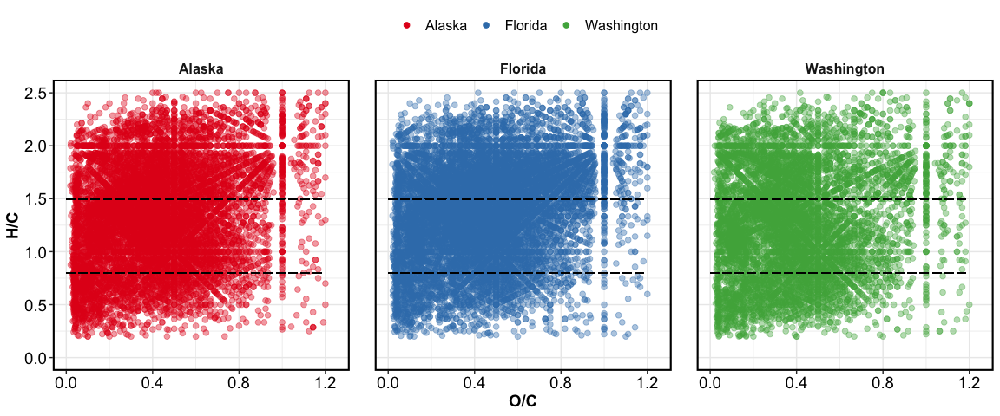<!-- -->

## treatment effect – all peaks

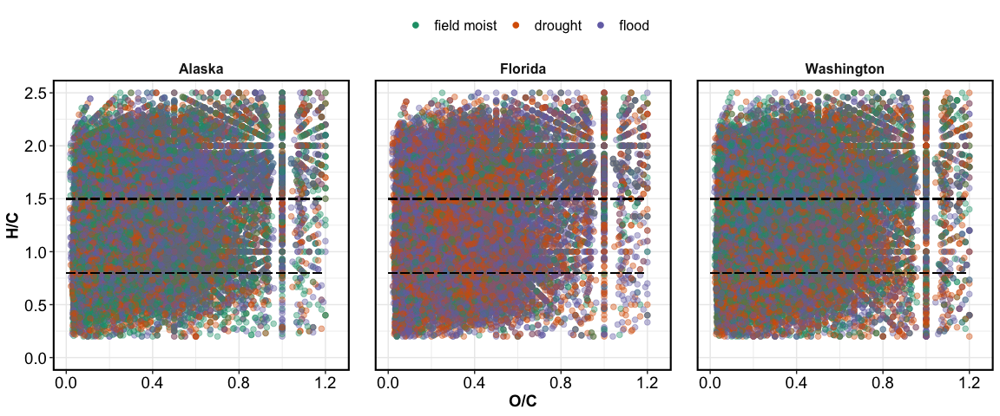<!-- -->

## treatment effect – unique peaks

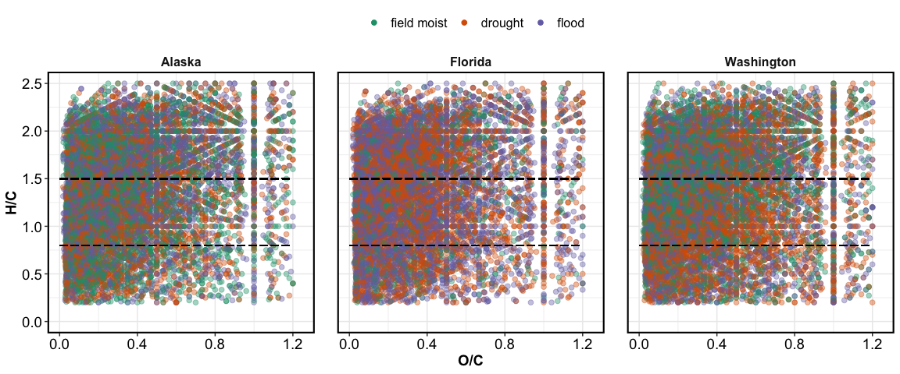<!-- -->

peaks lost and gained

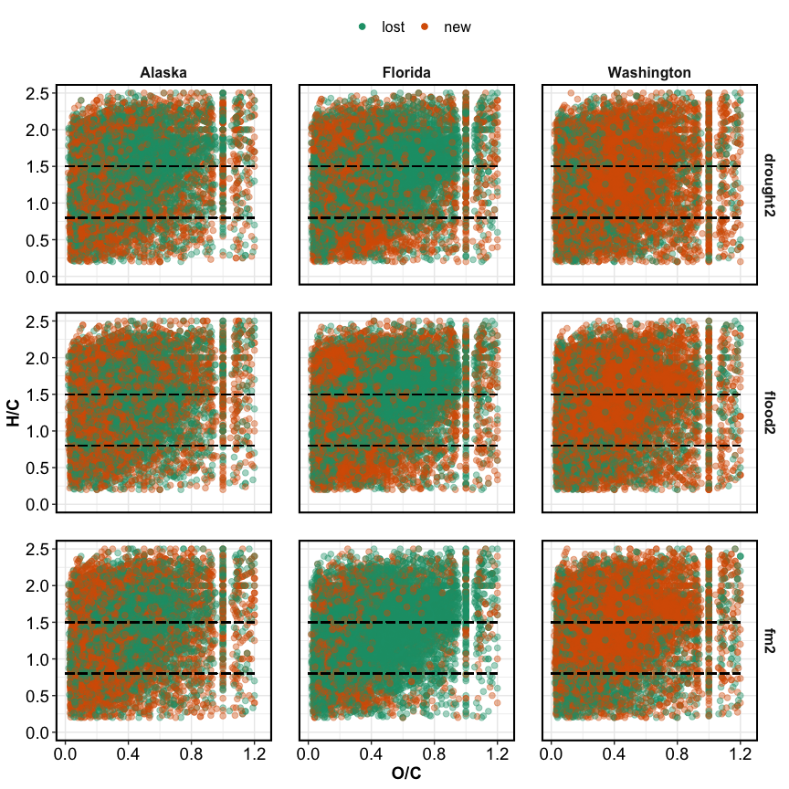<!-- -->

## treatment effect – relative abundance

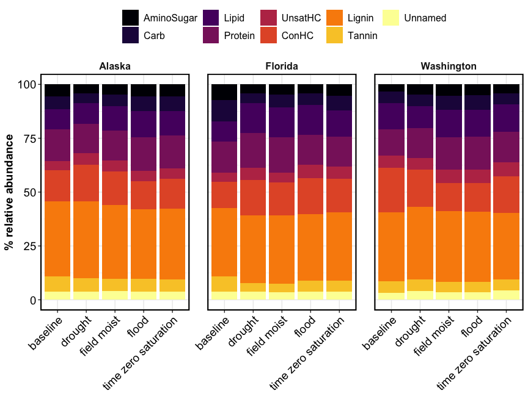<!-- -->

## NOSC

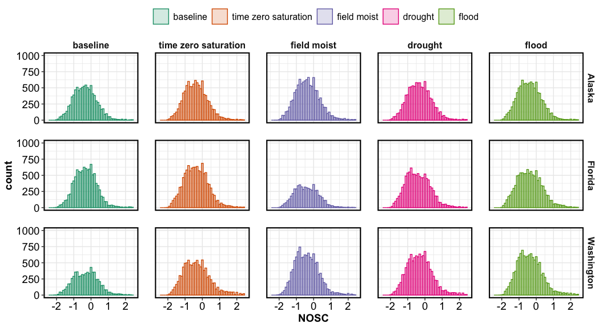<!-- -->

## NOSC table

|       site | baseline | drought | field moist |   flood | time zero saturation |
|-----------:|---------:|--------:|------------:|--------:|---------------------:|
|     Alaska |  -0.3636 | -0.3529 |     -0.3846 | -0.4211 |              -0.4000 |
|    Florida |  -0.3200 | -0.4545 |     -0.4444 | -0.4211 |              -0.3871 |
| Washington |  -0.2963 | -0.3333 |     -0.4444 | -0.4286 |              -0.3750 |

## lost/gained NOSC

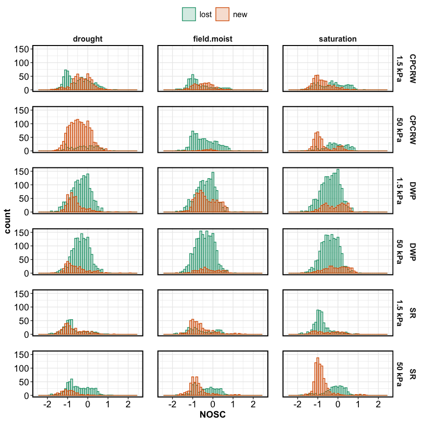<!-- -->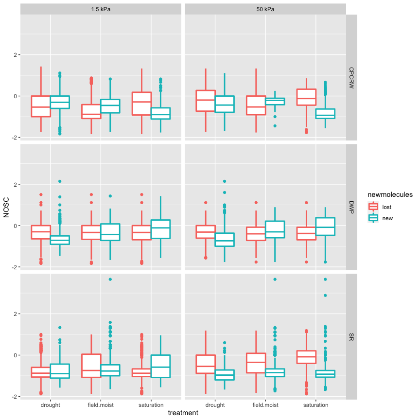<!-- -->

------------------------------------------------------------------------

## aromatic peaks

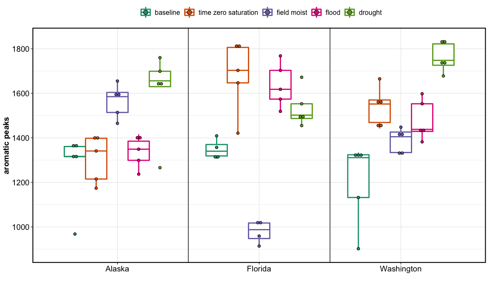<!-- -->

------------------------------------------------------------------------

# FTICR Soil – tables

## relative abundance

|       site |      Class |     baseline |         drought |     field moist |           flood | time zero saturation |
|-----------:|-----------:|-------------:|----------------:|----------------:|----------------:|---------------------:|
|     Alaska | AminoSugar |  5.46 ± 0.16 |  4.06 ± 0.11 \* |   4.63 ± 0.1 \* |     5.66 ± 0.11 |          5.53 ± 0.15 |
|     Alaska |       Carb |  6.16 ± 0.16 |  4.57 ± 0.06 \* |   5.53 ± 0.1 \* |  6.64 ± 0.12 \* |          6.72 ± 0.12 |
|     Alaska |      Lipid |   9.3 ± 0.34 |      9.8 ± 0.17 | 11.16 ± 0.23 \* |  12.22 ± 0.2 \* |         11.43 ± 0.28 |
|     Alaska |    Protein | 14.68 ± 0.24 | 13.48 ± 0.19 \* |       14 ± 0.13 | 15.67 ± 0.17 \* |          15.44 ± 0.3 |
|     Alaska |    UnsatHC |   4.1 ± 0.27 |   5.4 ± 0.17 \* |   5.2 ± 0.08 \* |  4.89 ± 0.07 \* |          4.82 ± 0.04 |
|     Alaska |      ConHC | 14.62 ± 0.43 | 16.89 ± 0.38 \* |     15.51 ± 0.1 | 12.99 ± 0.23 \* |          13.8 ± 0.26 |
|     Alaska |     Lignin | 34.91 ± 0.48 |    35.65 ± 0.18 |    34.32 ± 0.32 | 32.26 ± 0.23 \* |         32.77 ± 0.32 |
|     Alaska |     Tannin |  6.91 ± 0.29 |  6.24 ± 0.08 \* |  5.69 ± 0.08 \* |  5.86 ± 0.12 \* |           5.84 ± 0.1 |
|     Alaska |    Unnamed |  3.84 ± 0.11 |     3.91 ± 0.05 |     3.96 ± 0.02 |     3.81 ± 0.07 |           3.65 ± 0.1 |
|    Florida | AminoSugar |  7.31 ± 0.12 |   4.1 ± 0.07 \* |   4.7 ± 0.05 \* |  4.08 ± 0.09 \* |          5.21 ± 0.15 |
|    Florida |       Carb |  9.92 ± 0.05 |  4.64 ± 0.07 \* |  6.07 ± 0.08 \* |  5.51 ± 0.12 \* |          6.92 ± 0.12 |
|    Florida |      Lipid |  9.31 ± 0.08 | 13.72 ± 0.22 \* | 13.65 ± 0.09 \* |  13.85 ± 0.3 \* |         12.05 ± 0.47 |
|    Florida |    Protein | 14.49 ± 0.11 | 16.29 ± 0.19 \* | 16.48 ± 0.14 \* | 13.77 ± 0.16 \* |         14.04 ± 0.06 |
|    Florida |    UnsatHC |  4.19 ± 0.03 |  5.58 ± 0.05 \* |  4.75 ± 0.05 \* |  6.23 ± 0.07 \* |          5.47 ± 0.16 |
|    Florida |      ConHC | 12.17 ± 0.22 | 16.38 ± 0.09 \* | 15.19 ± 0.23 \* |  16.71 ± 0.3 \* |         15.82 ± 0.12 |
|    Florida |     Lignin | 31.74 ± 0.17 |    31.48 ± 0.19 |    31.57 ± 0.19 |    31.03 ± 0.25 |         31.49 ± 0.32 |
|    Florida |     Tannin |  7.03 ± 0.05 |  4.07 ± 0.09 \* |  4.15 ± 0.11 \* |   4.91 ± 0.1 \* |          5.11 ± 0.15 |
|    Florida |    Unnamed |  3.84 ± 0.04 |     3.74 ± 0.07 |   3.44 ± 0.1 \* |     3.91 ± 0.07 |          3.89 ± 0.04 |
| Washington | AminoSugar |  3.41 ± 0.13 |  4.64 ± 0.08 \* |  5.26 ± 0.22 \* |  5.13 ± 0.11 \* |          4.18 ± 0.06 |
| Washington |       Carb |  5.33 ± 0.03 |     5.48 ± 0.11 |  6.56 ± 0.45 \* |  6.63 ± 0.38 \* |          4.94 ± 0.19 |
| Washington |      Lipid | 12.02 ± 0.23 | 10.06 ± 0.26 \* |    12.78 ± 0.21 |    12.45 ± 0.15 |         12.79 ± 0.17 |
| Washington |    Protein | 12.17 ± 0.47 |    14 ± 0.39 \* | 14.93 ± 0.48 \* | 15.35 ± 0.19 \* |          14.15 ± 0.2 |
| Washington |    UnsatHC |  5.76 ± 0.13 |     5.37 ± 0.13 |  6.32 ± 0.13 \* |      6.16 ± 0.1 |          6.61 ± 0.11 |
| Washington |      ConHC | 20.77 ± 0.76 | 17.19 ± 0.19 \* | 12.84 ± 0.89 \* |  13.3 ± 0.48 \* |          17.08 ± 0.3 |
| Washington |     Lignin | 31.98 ± 0.26 |  33.9 ± 0.42 \* | 33.08 ± 0.16 \* |    32.68 ± 0.22 |         30.76 ± 0.31 |
| Washington |     Tannin |  5.24 ± 0.13 |     5.28 ± 0.12 |   4.7 ± 0.06 \* |  4.74 ± 0.08 \* |           5.1 ± 0.04 |
| Washington |    Unnamed |  3.32 ± 0.06 |  4.09 ± 0.05 \* |     3.53 ± 0.08 |     3.56 ± 0.16 |          4.38 ± 0.15 |

## peaks

|       site |      Class | baseline | drought | field moist | flood | time zero saturation |
|-----------:|-----------:|---------:|--------:|------------:|------:|---------------------:|
|     Alaska | AminoSugar |      495 |     431 |         523 |   587 |                  540 |
|     Alaska |       Carb |      554 |     472 |         603 |   675 |                  655 |
|     Alaska |      Lipid |      914 |    1056 |        1304 |  1353 |                 1226 |
|     Alaska |    Protein |     1313 |    1366 |        1528 |  1627 |                 1527 |
|     Alaska |    UnsatHC |      427 |     608 |         618 |   577 |                  544 |
|     Alaska |      ConHC |     1358 |    1684 |        1711 |  1379 |                 1376 |
|     Alaska |     Lignin |     3032 |    3414 |        3596 |  3237 |                 3156 |
|     Alaska |     Tannin |      587 |     603 |         598 |   585 |                  563 |
|     Alaska |    Unnamed |      385 |     428 |         463 |   436 |                  391 |
|     Alaska |      total |     9065 |   10062 |       10944 | 10456 |                 9978 |
|    Florida | AminoSugar |      742 |     435 |         291 |   448 |                  615 |
|    Florida |       Carb |      994 |     476 |         369 |   589 |                  774 |
|    Florida |      Lipid |      990 |    1462 |         841 |  1555 |                 1447 |
|    Florida |    Protein |     1480 |    1653 |         982 |  1458 |                 1615 |
|    Florida |    UnsatHC |      461 |     632 |         308 |   716 |                  683 |
|    Florida |      ConHC |     1272 |    1649 |         923 |  1787 |                 1839 |
|    Florida |     Lignin |     3215 |    3088 |        1868 |  3191 |                 3551 |
|    Florida |     Tannin |      706 |     425 |         259 |   523 |                  596 |
|    Florida |    Unnamed |      406 |     415 |         223 |   454 |                  486 |
|    Florida |      total |    10266 |   10235 |        6064 | 10721 |                11606 |
| Washington | AminoSugar |      247 |     552 |         625 |   607 |                  427 |
| Washington |       Carb |      373 |     631 |         776 |   755 |                  495 |
| Washington |      Lipid |      835 |    1220 |        1546 |  1505 |                 1316 |
| Washington |    Protein |      836 |    1618 |        1725 |  1782 |                 1406 |
| Washington |    UnsatHC |      410 |     651 |         767 |   770 |                  687 |
| Washington |      ConHC |     1368 |    2000 |        1503 |  1621 |                 1737 |
| Washington |     Lignin |     2111 |    3758 |        3702 |  3651 |                 2951 |
| Washington |     Tannin |      362 |     607 |         536 |   547 |                  510 |
| Washington |    Unnamed |      252 |     504 |         448 |   461 |                  481 |
| Washington |      total |     6794 |   11541 |       11628 | 11699 |                10010 |

## unique peaks

|       site |      Class | drought | field moist | flood |
|-----------:|-----------:|--------:|------------:|------:|
|     Alaska | AminoSugar |     153 |         161 |   166 |
|     Alaska |       Carb |     150 |         190 |   209 |
|     Alaska |      Lipid |     513 |         659 |   674 |
|     Alaska |    Protein |     469 |         484 |   552 |
|     Alaska |    UnsatHC |     289 |         284 |   298 |
|     Alaska |      ConHC |     634 |         650 |   440 |
|     Alaska |     Lignin |     965 |        1012 |   844 |
|     Alaska |     Tannin |     157 |         147 |   149 |
|     Alaska |    Unnamed |     202 |         221 |   210 |
|    Florida | AminoSugar |     147 |          72 |   140 |
|    Florida |       Carb |     125 |          71 |   184 |
|    Florida |      Lipid |     734 |         271 |   832 |
|    Florida |    Protein |     627 |         194 |   515 |
|    Florida |    UnsatHC |     329 |         123 |   386 |
|    Florida |      ConHC |     620 |         236 |   735 |
|    Florida |     Lignin |     962 |         323 |  1043 |
|    Florida |     Tannin |     151 |          58 |   189 |
|    Florida |    Unnamed |     222 |          84 |   251 |
| Washington | AminoSugar |     196 |         171 |   172 |
| Washington |       Carb |     211 |         184 |   168 |
| Washington |      Lipid |     541 |         690 |   647 |
| Washington |    Protein |     517 |         522 |   521 |
| Washington |    UnsatHC |     257 |         319 |   332 |
| Washington |      ConHC |     851 |         511 |   632 |
| Washington |     Lignin |    1110 |         966 |   964 |
| Washington |     Tannin |     246 |         147 |   175 |
| Washington |    Unnamed |     253 |         211 |   221 |

## aromatic peaks

## Shannon diversity

| treatment            | Alaska      | Florida     | Washington  |
|:---------------------|:------------|:------------|:------------|
| baseline             | 1.92 ± 0.01 | 1.99 ± 0    | 1.9 ± 0.01  |
| drought              | 1.89 ± 0 \* | 1.91 ± 0 \* | 1.92 ± 0    |
| field moist          | 1.92 ± 0.01 | 1.93 ± 0 \* | 1.94 ± 0 \* |
| flood                | 1.96 ± 0 \* | 1.95 ± 0 \* | 1.95 ± 0 \* |
| time zero saturation | 1.95 ± 0    | 1.96 ± 0    | 1.95 ± 0    |

# Respiration

## figures

Time series of CO2 flux 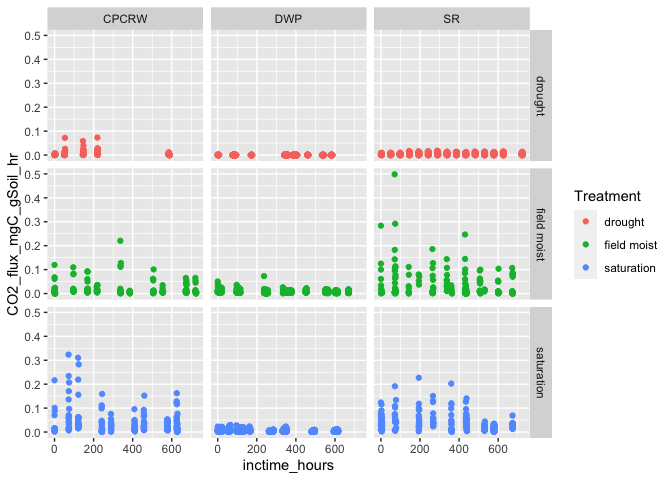<!-- -->

Flux by site/treatment 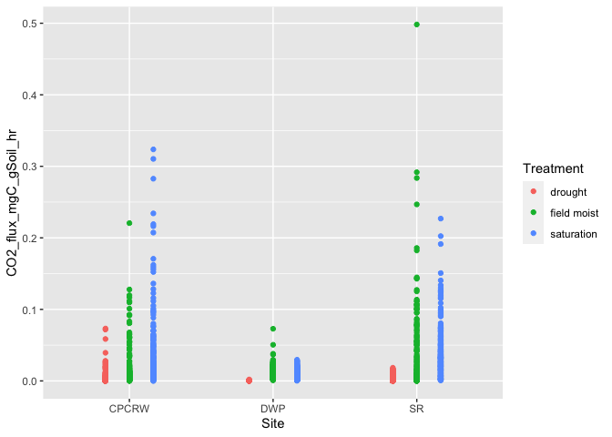<!-- -->

## flux summary table
